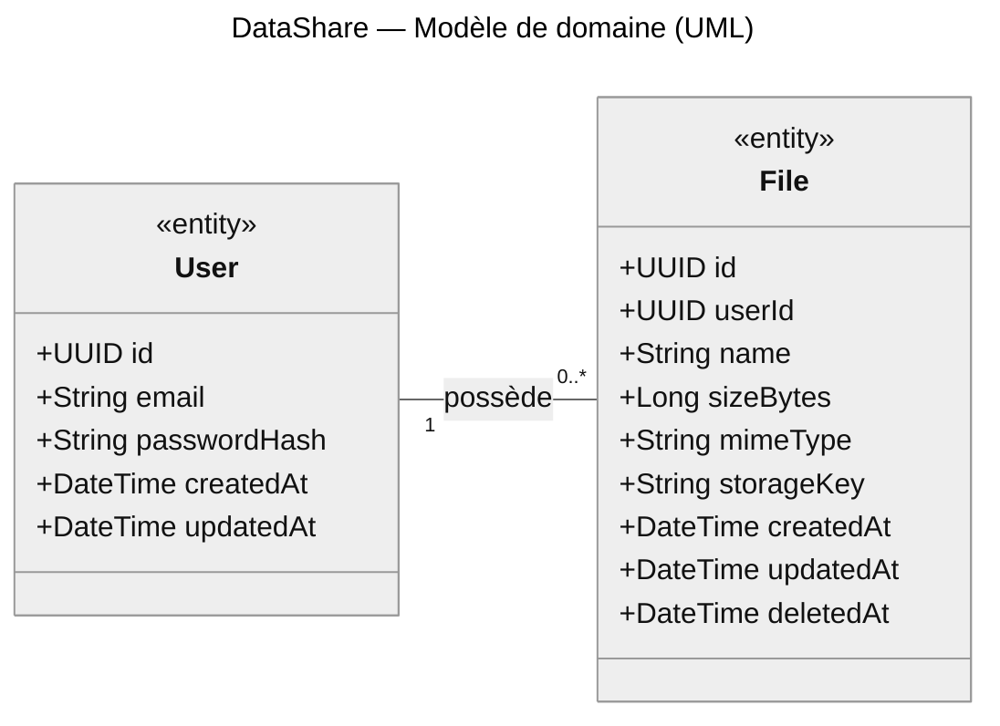

# Modèle de Domaine — DataShare MVP

> Livrable étape 1 OC, **section 3 du Livrable 1** (« Modèle de données »).
> Notation : **UML** (diagramme de classes du domaine).
> Version travail (Markdown + Mermaid) versionnée Git. Version finale (export Mermaid SVG ou Lucidchart UML) à intégrer dans le PDF du Livrable 1.

## Contexte

DataShare est un service de partage de fichiers via lien unique pour utilisateurs authentifiés. Le périmètre MVP est strictement défini par les **6 US obligatoires** (US01-US06) ; les US optionnelles (US07-US10) sont **explicitement hors scope** (cf. `CLAUDE.md` — ambiguïté #1). Le modèle est conçu pour rester **extensible en V2** sans cassure (Open/Closed Principle).

## Choix de notation : UML

Le gabarit OC autorise UML **ou** Merise pour la section 3. **UML retenu** pour quatre raisons :

1. **Cohérence avec la stack orientée objet** — Symfony/Doctrine mappe directement classes → tables. La notation UML reflète cette structure sans transposition.
2. **Universalité** — UML est un standard mondial OMG, défendable hors contexte francophone (Merise reste très français).
3. **Couverture multi-diagrammes** — UML couvre aussi diagrammes de séquence, déploiement, etc. Une seule notation pour toute la doc technique.
4. **Outillage repo** — Mermaid `classDiagram` rend nativement sur GitHub, pas de dépendance externe pour la version travail.

Conséquence terminologique : l'artefact s'appelle **« modèle de domaine »** ou **« diagramme de classes du domaine »**. Le terme **« MCD »** est strictement Merise et n'est pas utilisé ici. À l'oral : *« j'ai choisi UML pour la section 3, l'artefact présenté est donc le modèle de domaine UML — équivalent fonctionnel du MCD Merise »*.

## Diagramme Mermaid (version travail)



**Lecture des multiplicités UML :**

- `1` **côté User** = pour 1 instance de `File`, il y a exactement 1 `User` propriétaire.
- `0..*` **côté File** = pour 1 instance de `User`, il y a 0 à N `File` possédés.

→ La multiplicité se lit toujours **du côté de la classe ciblée** : « combien d'instances de cette classe pour une instance de l'autre ».

> ⚠️ **Piège vs Merise (à connaître pour l'oral) :** en Merise, `(0,N)` est noté **côté USER** pour signifier *« un user participe 0 à N fois à la relation »*. En UML, le même fait métier est noté **côté File** sous la forme `0..*` pour signifier *« pour 1 user, il y a 0 à N files »*. Les deux notations décrivent la **même réalité métier** mais sont **placées de l'autre côté du diagramme**. Si on transpose Merise → UML en gardant la position, on inverse la sémantique.

Les types affichés (`String`, `Long`, `DateTime`) sont les types « langage objet ». Le mapping vers les types SQL PostgreSQL se trouve dans les tableaux d'attributs ci-dessous.

## Entités

### User

Représente un utilisateur authentifié de DataShare. Source : US03 (création de compte), US04 (connexion).

| Attribut | Type | Contraintes | Origine |
|---|---|---|---|
| `id` | UUID | PK | Identifiant non prédictible, cohérent avec ADR 0003 |
| `email` | VARCHAR(255) | UNIQUE, NOT NULL, indexed, **lowercased à l'écriture** | US03 « adresse email doit être unique » + bonne pratique anti-doublon de casse |
| `password_hash` | VARCHAR(255) | NOT NULL, **Argon2id** via Symfony PasswordHasher | US03 « stocké de manière sécurisée (hashé, salé) » |
| `created_at` | TIMESTAMPTZ | NOT NULL, DEFAULT NOW() | Audit |
| `updated_at` | TIMESTAMPTZ | NOT NULL, mise à jour auto via Doctrine `#[ORM\PreUpdate]` | Audit |

**Index :** `email` (UNIQUE BTree).

**Champs explicitement écartés du MVP :**

| Champ écarté | Raison |
|---|---|
| `first_name`, `surname` | US03 ne demande pas de nom. La maquette « Mon espace » qui montre *« Claire Marie »* est traitée comme contenu décoratif (cf. `docs/maquettes/NOTES.md`). Ajout V2 = migration Doctrine simple (OCP). |
| `email_verified_at` | US03 « aucun email de confirmation requis (sauf évolution) » |
| `last_login_at` | Pas demandé par les US, audit non critique en MVP |
| `deleted_at` (soft delete) | Pas d'US de suppression de compte en MVP |
| `roles` / `permissions` | Pas de modèle de rôles en MVP — US04 distingue uniquement authentifié vs anonyme |

### File

Représente une instance de fichier uploadé par un utilisateur, associée à un lien de téléchargement unique. Source : US01 (upload), US02 (téléchargement), US05 (historique), US06 (suppression).

| Attribut | Type | Contraintes | Origine |
|---|---|---|---|
| `id` | UUID | PK | **Sert directement de share-token** dans l'URL `/files/{uuid}/download`. Cohérent US02 « identifiant unique non prédictible » |
| `user_id` | UUID | **NULLABLE**, FK → users(id), **ON DELETE SET NULL** | US01 « lié à l'identifiant utilisateur ». NULLABLE en schéma pour anticiper US07 (upload anonyme) en V2 sans migration. **En MVP, contrainte applicative : le service métier exige toujours un user à la création.** |
| `name` | VARCHAR(255) | NOT NULL | US05 « affiche le nom du fichier » |
| `size_bytes` | BIGINT | NOT NULL, CHECK (`> 0 AND <= 1073741824`) | US05 « affiche sa taille » + ADR 0001 (limite 1 Go) |
| `mime_type` | VARCHAR(255) | NOT NULL | US02 « métadonnées : type » + nécessaire pour le `Content-Type` au download. Détecté côté serveur via magic bytes (cf. ambiguïté #6) |
| `storage_key` | VARCHAR(500) | NOT NULL | Clé opaque consommée par `StorageInterface` (cf. ADR 0003 D4). Séparée de l'`id` pour découpler URL publique et organisation interne du stockage (DIP). |
| `created_at` | TIMESTAMPTZ | NOT NULL, DEFAULT NOW() | US05 « date d'envoi » |
| `updated_at` | TIMESTAMPTZ | NOT NULL, mise à jour auto via Doctrine | Audit |
| `deleted_at` | TIMESTAMPTZ | **NULLABLE** — `NULL` = disponible, `NOT NULL` = supprimé. | US06 soft delete + US05 `état`. Le blob physique est supprimé du stockage lors de la suppression ; la métadonnée est conservée en BDD à titre d'audit. |

> **État dérivé (logique applicative) :** `deleted_at IS NULL → état = "disponible"` / `deleted_at IS NOT NULL → état = "supprimé"`. Le champ `status` exposé dans l'API est calculé à partir de `deleted_at`, non stocké en BDD.

**Index :**
- PK sur `id` (BTree, automatique).
- **Composite `(user_id, created_at DESC)`** — sert directement la requête US05 « historique d'un user trié par date d'envoi décroissante ». Justification dans `docs/conception/notes-techniques/index-composite-pour-listes-utilisateur.md`.

**Champs explicitement écartés du MVP :**

| Champ écarté | Raison |
|---|---|
| `password_hash` (au niveau fichier) | US09 hors MVP |
| `expires_at`, `expiration_duration` | US10 hors MVP |
| `tags` ou table de jonction `file_tag` | US08 hors MVP |
| `download_count`, `last_downloaded_at` | Non demandé par les US, audit non critique |
| `state` (enum disponible/expiré) | Sans US10, pas d'état autre que « disponible » ou « supprimé » — couvert par `deleted_at` |
| `original_filename` séparé de `name` | Le nom affiché en historique = le nom uploadé. Pas de transformation. |

## Relations

### User **possède** File

| Côté | Multiplicité UML | Lecture |
|---|---|---|
| User | `1` | Pour 1 `File`, il y a exactement 1 `User` propriétaire |
| File | `0..*` | Pour 1 `User`, il peut y avoir 0 à N `File` possédés |

**Contrainte schéma :** `File.userId` est NULLABLE pour anticiper US07 (upload anonyme = `userId = NULL`).

**Comportement à la suppression d'un User** (hors MVP mais anticipé) : `ON DELETE SET NULL` — les fichiers de l'user deviennent orphelins (`userId = NULL`) plutôt que d'être supprimés en cascade. Audit / nettoyage manuel dans une procédure de purge V2.

## Logique métier — règles transverses

| Règle | Source | Implémentation prévue |
|---|---|---|
| Email lowercased à l'écriture | Bonne pratique | Setter de l'entité `User` ou listener Doctrine |
| Mot de passe ≥ 8 caractères | US03 | Validation côté form (Symfony Validator) + côté service |
| Fichier ≤ 1 Go | US01 + ADR 0001 | Middleware Symfony (rejet 413) + check applicatif |
| Extensions interdites | US01 + ambiguïté #6 | Validation extension côté front + magic bytes côté service back |
| Suppression fichier | US06 | Service métier : autorisation owner → `StorageInterface.delete(storageKey)` (blob supprimé) → `UPDATE files SET deleted_at = NOW() WHERE id = ?` (métadonnée conservée). Ordre : d'abord le stockage, puis le marquage BDD. Le lien de partage retourne 404 dès que `deleted_at IS NOT NULL`. |
| Lien de téléchargement unique non prédictible | US02 | UUID v4 utilisé directement comme share-token |

## Évolution V2 (préparée par la conception)

| Évolution | Migration nécessaire |
|---|---|
| Ajout nom utilisateur (US futur) | `ALTER TABLE users ADD COLUMN first_name VARCHAR(100), ADD COLUMN surname VARCHAR(100);` |
| US07 upload anonyme | **Aucune migration** — `user_id` est déjà NULLABLE. Juste relâcher la contrainte applicative. |
| US08 tags | Création table `tags` + table de jonction `file_tag` |
| US09 mdp fichier | `ALTER TABLE files ADD COLUMN password_hash VARCHAR(255) NULL;` |
| US10 expiration | `ALTER TABLE files ADD COLUMN expires_at TIMESTAMPTZ NULL;` + cron de purge |

## Génération de l'image pour le PDF L1

Deux workflows possibles pour produire l'image qui ira dans la **section 3 du Livrable 1**.

### Option A — Export Mermaid (simple, recommandé en MVP)

1. Copier le bloc `classDiagram` ci-dessus dans [mermaid.live](https://mermaid.live).
2. Bouton **Actions → SVG** (préféré pour le PDF, zoom sans pixellisation) ou PNG.
3. Intégrer le fichier dans le PDF L1 section 3.

Alternative CLI :

```bash
npm install -g @mermaid-js/mermaid-cli
mmdc -i modele-domaine.mmd -o modele-domaine.svg -t neutral
```

**Limite connue** : Mermaid `classDiagram` ne souligne pas les PK nativement. Compensé par la convention de nommage (`id` = PK, `xxxId` = FK) **et** par les tableaux d'attributs détaillés ci-dessus. À défendre à l'oral si le mentor pinaille.

### Option B — Lucidchart UML (notation 100 % stricte)

Pertinent **si** on veut PK soulignée visuellement dans le PDF (notation UML stricte).

1. Nouveau diagramme Lucidchart, palette **« UML Class Diagram »**.
2. Pour chaque classe :
   - Rectangle à 3 compartiments (nom / attributs / méthodes).
   - Stéréotype `<<entity>>` au-dessus du nom.
   - **PK soulignée**, FK en *italique* (convention UML).
   - Types « langage objet » (`String`, `Long`, `DateTime`) ; mapping SQL en commentaire ou table jointe.
3. Association `User ─── File` :
   - Ligne simple (pas de losange — le losange UML signifie agrégation, à n'utiliser que si sémantiquement justifié).
   - Label `possède` au milieu.
   - Multiplicité `1` côté **User**, `0..*` côté **File**.
4. Légende PK / FK / multiplicités.
5. Export PNG ou SVG pour intégration PDF.

## Références

- Spécification fonctionnelle pp. 2-5 (US01-US06).
- ADR 0001 — streaming back (limite 1 Go).
- ADR 0002 — JWT auth (User.password_hash).
- ADR 0003 — stack technique (PostgreSQL, Symfony/Doctrine, FS local + abstraction).
- `CLAUDE.md` — ambiguïtés #1 (hors MVP), #6 (extensions).
- `docs/maquettes/NOTES.md` — écarts maquette (ex. nom utilisateur).
- `docs/conception/notes-techniques/index-composite-pour-listes-utilisateur.md` — justification de l'index composite.
